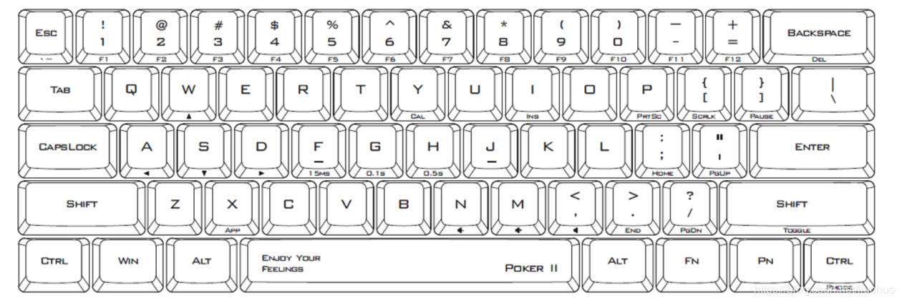
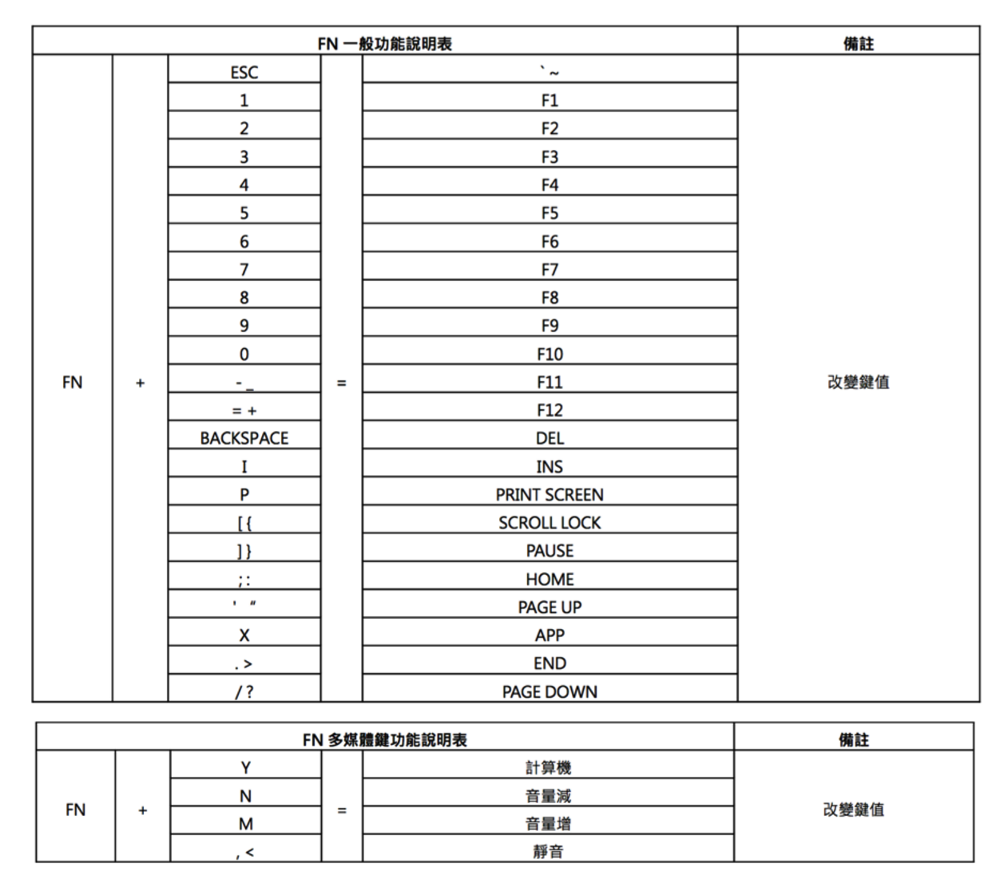
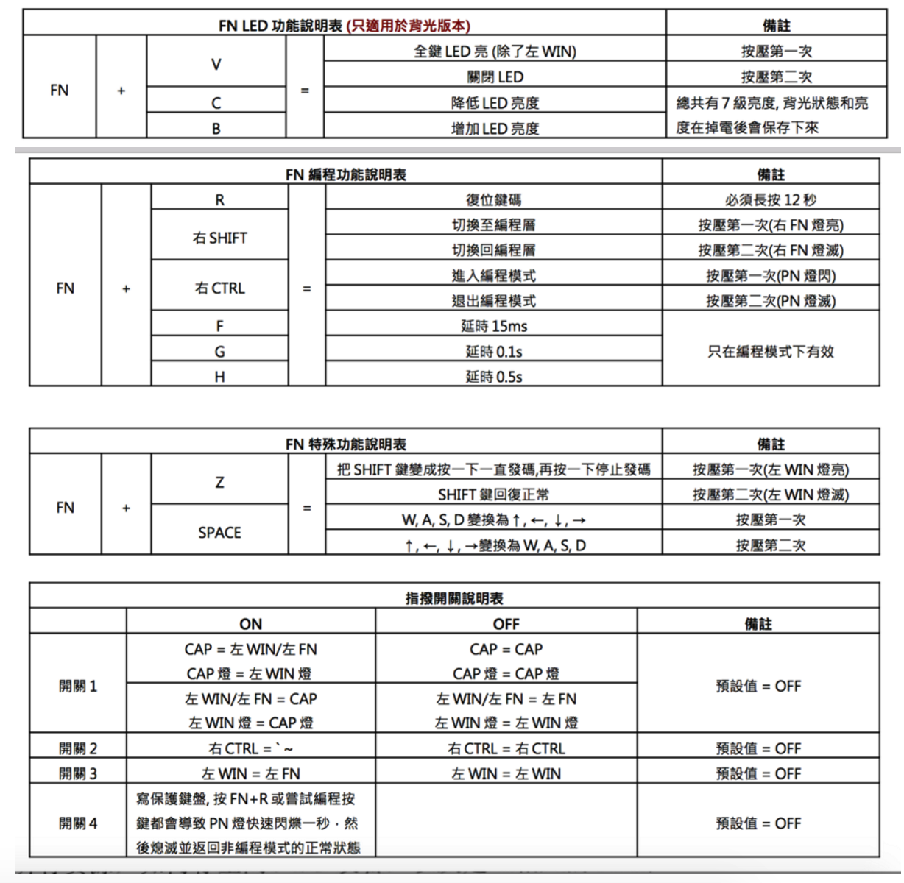

## 使用说明书

#### 主要功能介绍: 

1. 可携带式 
2. 60%键盘 搭配 QWERTY 配置(61 Key) 
3. Cherry MX 系列轴 (黑、青、茶、红) 
4. 双层板 PCB 
5. 键帽材质: ABS(喷漆镀膜-LED 专用)、PBT 
6. LED 背光功能 (LED 专用) 
7. USB 介面

#### 包装内容物 

1. 键盘x1
2. 使用手册 x 1 
3. USB连接线x1

#### 技术性资料 
键数:
US ASCII (61 keys) = US 配置 
尺寸:
约. 29.5 x 10.2 x 3.8cm (键盘) 
连接线:
约 1.5 米 (mini USB B type) 
按键使用寿命:
Cherry: >5000 万次

#### 包装:
20 键盘/1 纸箱

#### 介面: 
USB (DC5V —-100mA) 
#### 可用配置: 
US USA

#### 编程说明 

1. 按 PMode(FN + 右 CTRL) 进入编程模式 (空格右灯闪烁) 
2. 按想要对其编程的键 (空格右灯长亮) 
3. 键入编程内容然后按 PN (空格右灯再次闪烁) 【如果发现没有闪烁，可能是键盘后面第四个开关没有变为off】【如果输入着输入着发现空格爆闪，那就是说明超过了14个按键】
4. 重复步骤 2 和步骤 3 可编程其他键 
5. 按 PMode(FN + 右 CTRL) 退出编程模式 (空格右灯熄灭)

#### 备注: 
• 支持 FN 层编程,在选键状态时可以对 FN 组合键(例如: FN + A)编程 
• 在选键状态(步骤 1)打开文书软件(比如.txt 型文本文档)并按 PN + 任意键可自动分层显示其编程内容 
• 可以加延时,每按 15ms 键(FN + F) 一次延时 15ms,每按 0.1s 键(FN + G) 一次延时 0.1s,每按 0.5s 键(FN + H) 一次延时 0.5s, 连续多次延时只计一个按键但时间累加 
• 每个键最多可以编程 14 个按键 
• 在编程模式 15 秒内没按任何按键会自动退出
#### 编程使用 
按 PN + 已编好程的键,或者
先按 Toggle(FN+右 SHIFT)让空格左灯亮起,再直接按已编程好的键,此时若按 PN + 已编好程的键会输出原来的键码

1. 编程示例 
  把A编为123:FN+右CTRL,A,1,2,3,PN 
  继续把FN+A编为456:FN+A,4,5,6,PN 
  继续把 B 编为 CTRL+C: B, CTRL(不放手), 再按 C, 放开 CTRL 和 C, PN 
  继续把 C 编为在 WIN7 下调用 CMD.EXE: WIN, C,FN+G,M,FN+G,D,FN+H,ENTER, PN 
  结束:FN+右CTRL 
  使用已编程的A键:PN+A =>输出123 
  使用已编程的FN+A键:PN+FN+A =>输出456 
  使用已编程的 C 键: PN + C => CMD.EXE 程序调用

切换编程直接表达层:
Toggle(FN + 右 SHIFT) => 右 FN 灯亮起 
(1)使用已编程的B键:B =>输出CTRL+C的码(注:等如复制) 
(2)使用已编程的 FN + A 键: FN+ A => 输出 456(注: 不需要再按 PN 键) 
(3)使用已编程的 C 键: C=>调用 CMD.EXE 程序
(4)如果要输出 A 键(此时直接按 A 是输出 123): PN + A => A
返回出厂设定 
按住 FN + R, 三秒后 Toggle 灯开始闪烁,继续按住 FN + R 直至空格左灯闪了 9 次便会回复出厂设定

