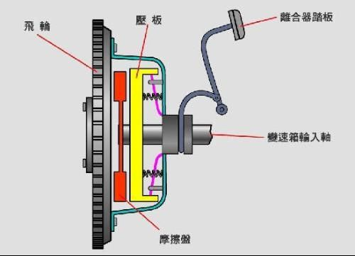
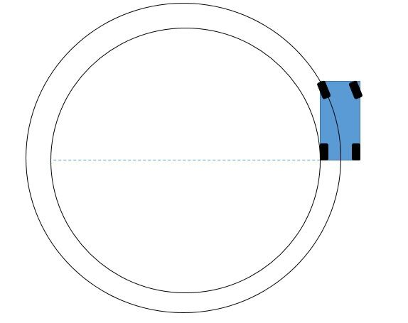

---

title: 科目二笔记
type: tags  
layout: tags  
date: 2019-02-22 21:41:27

---

## 倒车入库

## 坡道定点停车和起步

## 侧方停车

## 曲线行驶

## 直角转弯

---

## 汽车原理

### 1.离合与换挡

发动机和车轮传动轴是通过离合联接的。

可以简化为，发动机在不停旋转，另一边是一个车轮。中间是通过离合器相连。

**中间的离合器可以看成一个摩擦片。** 

- 左右紧紧压在一起时，发动机和车轮就死死连接住了；
- 如果完全分开，就互不影响；
- 如果略微压在一起，就是半离合。

**半离合的作用：**

点火，发动机旋转，但是车身还是静止的。如果完全把离合松开，摩擦片压死，后果就是高速旋转的发动机，与静止的车身传动轴，突然撞上了，然后发动机被蹩死了···

所以半离合是一个缓冲作用，慢慢接触。不仅是起步，换挡也是这样。

### 2.前行与倒车

车辆的转向是以过后轮轮轴上一点为圆心，进行圆弧运动

通过上图，你应该会发现：

- 前轮转向半径比后轮大，所以过S曲线，往往是后轮离内线很近，前轮离内线很远； 
- 倒车和前行，打方向是一致的。**方向盘往左打，无论是前行还是倒车，车都往左偏。**

### 科目二起步规范动作

> 调整座椅 系上安全带，调试后视镜 

1. 踩(踩离合器踏板)。

2. 挂(挂档)。

3. 打(打左转向灯)。

4. 鸣(按喇叭)。

5. 看(看左右反光镜和后视镜)， 侧(侧头看左边有无车辆和行人)。

6. 抬(抬离合器至半联动)。

7. 放(放手刹)。

8. 加(加油)。

### 科目二停车时的动作：

1. 右打转向
1. 踩离合
1. 踩刹车
1. 拉手刹
1. 归档
1. 松离合

### 手动档汽车刹车熄火问题

- 空挡踩刹车不需要踩离合。  
- 低速行驶先踩离合然后踩刹车
- 高速行驶先踩刹车，等速度降到足够低再踩离合。
- 汽车运行中踩刹车，只要不一脚踩死就不会熄火。
- 汽车运行中踩刹车，速度肯定降下来，假如降的不多，就不用换挡。**降的多了就踩离合换低挡。**

#### 判断车辆行驶在车道中间

> 左边喷水嘴对准车道中间即可

#### 左脚踩休息踏板的位置接近左轮的实际位置

#### 判断车辆位置以及靠边定点停车（车轮位置、前后位置）

- **左轮**在挡风玻璃**左A柱**往右10-15cm位置；
- **右轮**在挡风玻璃**右A柱**往左5-10cm位置

>  离路边距离可以从后视镜看到。
>
>

- 当我们在路上行驶时如何判断前车头与行人的距离呢，同样的道理，当我们看到行人的脚后跟时，我们距离行人约4或5米左右
- 如果我们看到行人的膝盖时，垂直距离约45厘米高，我们距离行人约2.5米左右
- 当我们看到行人的臀部时，垂直距离约75厘米高我们距离行人就很近了，就赶紧刹车吧，因为我们距离行人已经只有30厘米

