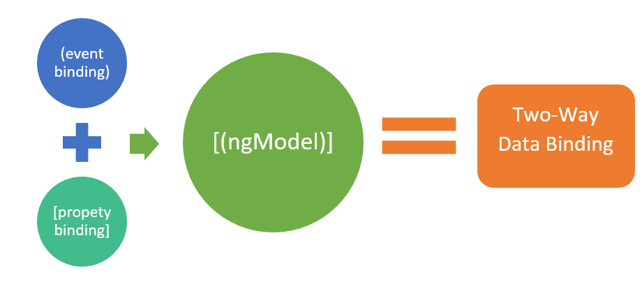

## React

React 是一个开源 JavaScript 库，可用于创建具有复杂用户界面的 Web 应用程序。React 允许开发人员构建可重用的定制组件，从而加快开发速度。

与所有编程框架 AngularJS 和 Vue 相比，React 是最早的 JavaScript 库。它由 Facebook 于 2013 年创建，作为为各种网站创建动态界面的工具。虚拟 DOM 是使用 React 组件构建的 DOM 元素的一种方式，也是 React 的基础。

## Vue 主要特点
Vue 还具有一些引人注目的功能，这些功能对于启动和运行企业应用程序非常有用。

### 虚拟 DOM
虚拟 DOM 是由几个 JavaScript 框架实现的概念，包括 Vue。不是适应 DOM，而是以 JS (JavaScript) 数据结构的形式构造和呈现 DOM 的虚拟副本。首先对 JavaScript 数据结构进行任何修改，然后将后者与初始数据结构相匹配。

### 双向数据绑定

如图所示，Vue 提供双向绑定功能，作为其 MVVM 框架的一部分。通过使用 Vue 提供的名为 v-bind 的绑定指令，此功能允许您编辑或将值应用于 HTML 元素、更改样式和应用类。这与仅提供单向通信的 React 等框架不同。

<!--  -->

### 组件
组件是具有自定义 HTML 元素的 Vue 对象，尤其是可以重用。Vue 对象和 HTML 元素通过 props(properties) 和事件相互交互。Vue 组件的代码块对于开发稳定且可扩展的 Vue 应用程序同样重要。

### 计算属性
计算属性有助于侦听对 UI 元素的修改并执行相关逻辑，从而无需进一步编码。当我们打算对依赖于另一个被更改属性的变量进行变异时，我们应该使用计算属性。其他数据属性严重影响计算属性。这是一个关于计算属性的简单示例，

    export detault {
        data() {
          return {
          author: {
            name :
            'Callum Scott' ,
            books: [
            'Vue2-SumGuide',
            'Vue 3 - Text Guide
            ]
          }
        }
      },
      computed: {
      // 计算属性的获取
        publishedBooksMessage() {
          return this.author.books.length > 0 ? 'Yes' : " No'
        }
      }
    }

### CSS 过渡和动画
当从 DOM 添加、更改或删除 HTML 元素时，此功能提供了多种方法来执行转换。它带有一个内置的过渡组件，该组件围绕负责过渡效果返回的元素。开发人员可以轻松使用第三方动画库来增强用户体验。

### 观察者模式
观察者用于可能定期更改的数据，例如表单输入元素。在这种情况下，开发人员不需要执行任何额外的操作。Watcher 处理任何数据更新，同时仍然保持代码简单和快速。

<!--  -->

观察者、方法和计算属性可以称为组件利用响应式的三种主要方式。当需要根据不断变化的数据执行异步或代价高昂的操作时，观察者是最佳选择。

## 反React主要特点
React 有一些引人注目的特性，这些特性对于启动和运行企业应用程序非常有用。下面解释了一些功能，

### 虚拟 DOM
这个 React 特性有助于加快应用程序开发过程的速度和敏捷性。该方法可以轻松地在 React 的虚拟内存中重新创建网页。因此使用虚拟 DOM 来模拟实际的 DOM。每当应用程序被修改或升级时，虚拟 DOM 通过恢复已更改的组件再次生成完整的 UI。这减少了开发某些东西所需的时间和金钱。

### 单向数据绑定

单向数据绑定意味着 React 利用单向数据流，使程序员能够使用回调函数来修改组件，而不是直接更改它们

Flux 是一个 JavaScript 应用程序设计组件，可让您控制来自固定位置的数据流。它赋予开发人员对软件的更多权限，使其更具适应性和实用性。Flux 包含三个主要部分，即调度程序、存储和视图（组件）。

### JSX、
JavaScript XML 是一种用于描述应用程序界面设计的标记语言。它创建了一种类似于 HTML 的语法，用于开发 React 组件。React JS 最好的方面之一是 JSX，它允许为开发人员编写极其简单的构建块。

### 组件
基于 React 的应用程序的 UI 由许多组件组成，每个组件都有其用 JS 编码的功能。因此，程序员可以在整个应用程序中发送数据而不影响 DOM。应用程序的图形和操作深受 React JS 组件的影响。

### 声明式用户界面
声明式 UI 功能使 React 代码更易于理解，错误修复更直接。不仅适用于在线应用程序，而且适用于移动应用程序，React JS 是创建动态和交互式用户界面的理想框架。

## Vue 和 React：相似之处和共同特征

Vue 是受 React 的启发而创建的。因此，可以找到以下一些相似之处：

* 渐进式 Web 应用程序 (PWA) 支持
* 虚拟 DOM 使用
* 查看既可组合又可反应的组件
* JavaScript 代码
* 专注于核心库，合作伙伴库涵盖网络和通用状态管理
* 能够与任何当前的 Web 应用程序集成

### 学习曲线
Vue 是迄今为止所有 JavaScript 框架中最容易学习和理解的。估计需要几个小时到不到一周的时间来学习。所需要的只是对 ES6 工作原理的基本了解和一些 JavaScript 编程知识。Vue 的文档也很容易掌握，因为它不像其他框架那样广泛。

对于以前使用过 JavaScript 的人来说，React 很容易上手。由于学习曲线较低，团队的组建变得更简单，任何初学者或专业开发人员都可以参与。只有 16.0 之后的版本是最新的。因此，新开发人员可能难以实现更复杂的功能。

### 性能（速度）
Vue 应用程序的状态随着每个新选项或组件的添加而变得更加不明确，从而使应用程序更难以更快地加载。幸运的是，这个框架包括一个虚拟 DOM 来提高应用程序的速度。Vue 最重要的特性之一是延迟加载。它有助于减少加载时间。

React 应用程序的性能更快，客户体验性能更简单，离散组件可以很好地协同工作。React 基于组件的结构有助于开发更强大的单页应用程序，而可重用性降低了代码复杂性，减少了 DOM 交互，加速了页面加载。此外，该库专注于对网站进行必要的修改，而无需重新加载整个页面。结果，它避免了浪费的页面加载，而是刷新了内容。

### 组件和可扩展性
在开发基于组件的用户界面时，Vue 和 React 中丰富的组件库可以更轻松地重用代码，提高开发人员的工作效率，并加快开发过程。

### 状态管理
由于 React 中的状态数据是不可变的，不能立即修改，因此您必须使用 setState() 函数（或 useState() 挂钩来更新本地状态中的任何内容。

但是，由于 Vue 对象的 data 属性作为应用程序数据的收集器，没有理由执行 setState() 之类的方法来更改 Vue 中的状态。

### 简化开发的工具和模板

自 2016 年以来，React 提供了一个名为 create-react-app 的第三方 CLI 工具，可帮助程序员完成应用程序构建、脚本编写等任务。以前，React 程序员必须从早期的应用程序中复制文件，或者从头开始。没有花很长时间，但这是一项乏味的努力。

另一方面，Vue 有一个名为 Vue CLI 的工具，可以快速构建项目。Vue CLI 有几个优点，包括在项目期间的任何时候添加插件的能力和简单的修改。

### 生态系统
Vue 是一个独立的框架，而 React 需要使用外部库。这是两种技术之间最显着的对比之一。对于路由和状态管理，React 依赖于 Flux/Redux 等其他系统。这些框架通过提供一种更改状态的单一方式使调试更容易。由于 Facebook 将 react-redux 和 react-router 的管理权委托给了用户，生态系统变得越来越支离破碎。

Vue 的合作库数量较少。尽管如此，Vue 目前包含需要在 React 中使用模块的功能，例如 props 验证。Vue 的关键框架，例如 Vuex 和 Vue-router，由 Vue 团队维护和支持。

### 安全
Vue 和 React 都存在安全漏洞，尽管 Vue 应用程序比基于 React 的应用程序更容易保护。虽然针对 XSS 问题的自动防御不可用，但 Vue 程序员可以在实现 HTML 代码之前对其进行清理，或者使用其他库来帮助防止攻击。在您知道 HTML 是安全的情况下，您可以直接生成网页并在生成前后保护应用程序。

为了防范 XSS 漏洞、SQL 注入和其他威胁，React 安全依赖于程序员遵循的安全标准。虽然 React 易于使用，但确保 React 项目的安全需要大量的技能和经验。

### 移动端开发
React Native 集成了原生开发和 React 的最大特性，这是一个用于创建用户界面的顶级 JavaScript 工具包。您现在可以将 React Native 与您现有的 Android 和 iOS 应用程序一起使用，或者您可以从零开始构建并构建一个全新的应用程序。使用 React Native 的类似 React 的组件，您可以在 Android 和 iOS 上重新利用多达 99% 的 JS 代码。因此，创建了一个外观和功能类似于纯 iOS/Android 应用程序的跨平台应用程序。

您可以制作完全原生的小部件，并且可以完全控制它们的外观。React Native 框架将表示层作为完美的状态输出处理，这使得创建具有自然外观和直观感觉的 iOS/Android 合作伙伴应用程序变得简单。

尽管 Vue 落后于 React，但它提供了多种移动开发选项。首先是 NativeScript，它可以让你编写 Vue 应用程序并将它们编译成原生 iOS/Android 应用程序。然后是电容器，由创建 Ionic 的同一个人创建。使用简单的 API，您可以将 Capacitor 集成到任何现有的 Vue 网站中，并提供原生 iOS/Android 功能。最后，Vue Native 结合了 Vue 和 React Native 生态系统的优势。在这个 React 可以被认为是最适合移动开发的一个。

### 测试和调试
Reactjs 带有几个有用的测试运行器，它们使开发过程更容易遵循。例如，像 Jest、Mocha 和许多其他测试运行程序，使测试人员能够遵循运行测试套件的通用方法，帮助他们发现实际浏览器设置中的缺陷、不需要的功能以及发生过度功能操作的点。它缩短了上市时间，加速了应用程序部署，并鼓励了更高效的氛围。

由于 Vue 刚刚开始，测试功能是标准的，但简单有效。它不提供过于奢侈的工具，也不危及代码的测试能力。Vue Testing Library 和 Vue Test Utils 是 Vue 官方推荐的两个库。因为这个框架支持 CI/CD 和热重载，所以可以建立更快的反馈机制。

## Vue 与 React 的缺点
与所有技术一样，Vue 和 React 都有各自的弱点。以下是每种方法的一些缺点。

### Vue 的缺点包括：

移动端的支持不太好
有限的插件
有限的可扩展性
编码规范难以统一
社区的使用有一些限制

### React 的最大缺点包括：

更新过快，程序员很难适应。
随着如此快速的更新和加速，也很难出现比较好的文档。
ReactJS 只处理应用程序的 UI 层，因此需要使用其他工具进行开发的其他部分。
如果有很多模板并且它们重叠，JSX对人不太友好。

