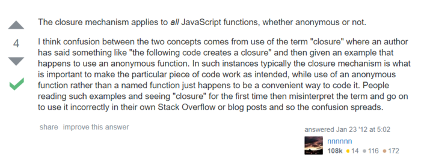

> 匿名函数就是闭包吗，匿名函数和闭包有关系吗，

不是，没有什么关系！

### 匿名函数？

通常大家所说的匿名函数，准备的说法应该是 **IIFE: Immediately Invoked Function Expression** 
意为**立即调用的函数表达式**,也就是说,声明函数的同时立即调用这个函数。

实际上，立即执行的匿名函数并不是函数，因为已经执行过了，所以它是一个结果，这个结果是对当前这个**匿名函数执行结果的一个引用**（函数执行默认return undefined）。

这个结果可以是一个字符串、数字或者null/false/true，也可以是对象、数组或者一个函数（对象和数组都可以包含函数），当返回的结果包含函数时，这个立即执行的匿名函数所返回的结果就是典型的闭包了。

### 闭包

> A closure is the combination of a function and the lexical environment within which that function was declared.

中文解释是：闭包是一个函数和该函数被定义时的词法环境的组合。

按照闭包起的作用来理解它：**就是能在一个函数外部执行这个函数内部的定义方法，并访问内部的变量**

	　function f1(){
	　　　　var n=999;
	　　　　function f2(){
	　　　　　　alert(n); 
	　　　　}
	　　　　return f2;
	　　}
	　　var result=f1();
	　　result(); // 999

#### 立即执行函数的应用

for循环的问题及解决方案

还有一个令人感到困惑，工作和学习中也经常遇见的问题是在for循环中：

	for(var i = 0;i<5;i++){
	  setTimeout(function(){
	    console.log(i);
	  },100*i);
	}
我们希望打印出来0,1,2,3,4，然而打印出来的是5个5。

什么原因引起的这问题呢？这是因为setTimeout的回调函数并不是立即执行的而是要等到循环结束才开始计时和执行（在此对运行机制不伸展）

要说明的一点是js中函数在执行前都只对变量保持引用，并不会真正获取和保存变量的值。所以等循环结束后i的值是已经是5了，因此执行定时器的回调函数会打印出5个5。

**怎么解决这个问题？**

最常见的解决方法就是给定时器外面加一个立即执行的匿名函数，并把当前循环的i作为实参传入这个立即执行的匿名函数。如下：

	for(var i = 0;i<5;i++){
	  (function(i){
	    setTimeout(function(){
	      console.log(i);
	    },100*i);
	  })(i);
	}
可以得到预想的结果：0,1,2,3,4

此时很多人认为这个立即执行的匿名函数就是闭包，其实这么理解是错误的，在错误的理解之上又扩展了好多案例

[https://stackoverflow.com/questions/8967214/what-is-the-difference-between-a-closure-and-an-anonymous-function-in-js。](https://stackoverflow.com/questions/8967214/what-is-the-difference-between-a-closure-and-an-anonymous-function-in-js。)

到底这个for循环中的闭包是什么呢，其中的自执行匿名函数又起到什么作用呢？
我们可以试着把这个自执行的匿名函数改写为具名的函数，来测试下结果:

	for(var i = 0;i<5;i++){
	  function hasNameFn(i){
	    setTimeout(function(){
	      console.log(i);
	    },100*i);
	  };
	  hasNameFn(i);
	}
可以发现结果和使用匿名函数的结果是一样的

**另外，使用es6的let或者bind绑定当前的i都可以达到一样的结果**

所以说**匿名函数和闭包之间并没有什么关系**，只不过很多时候在用到匿名函数解决问题的时候恰好形成了一个闭包，就导致很多人分不清楚匿名函数和闭包的关系
